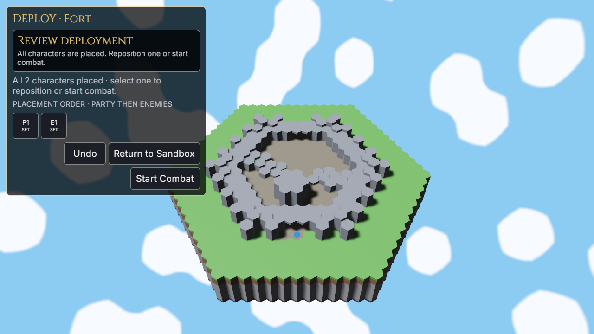

# Hex

> **A deterministic tactical RPG where every character, spell, and wound is a
> pattern of hexagons.**

*The original 2022 logo, kept as a fond artifact of where the project started.*

**Hex** is the working title for a party-based magic game built around one shape.
A party of up to six characters explores an isometric world in real time, then
shifts into deliberate turns when a fight or timed action begins. Travel and combat
happen on the same map: a three-dimensional landscape of hexagonal prisms where
elevation, routes, sight, and terrain all matter.

The repetition is the point. The world is made of hexes, but so are characters,
elements, and spells. Instead of collecting independent abilities and watching a
health bar fall, players arrange a connected magical structure and then fight to
keep its important relationships intact.

<!--
Regenerate readme_assets/procedural-hills.png with:
HEX_REVIEW_SCENARIO="Procedural Hills" \
HEX_REVIEW_CAPTURE="readme_assets/procedural-hills.png" \
cargo run --release -p hex_game --features map-review
-->

*The current Procedural Hills build. The same terrain supports exploration,
positioning, and combat.*

## Magic is geometry

Every character and enemy is defined by a **lattice**: a finite grid of hexagonal
cells containing elemental gems, spells, and fusions. Gems hold mana. A spell can
draw power only from the cells directly beside it, and a fusion combines adjacent
basic elements into a more complex ingredient.

That turns character building into a packing problem. An Ember spell needs one
neighboring fire gem; Fireball needs a complete ring of six. Sharing gems lets a
small lattice hold more spells, but those spells compete for the same mana and fail
together when a shared cell breaks. Spreading out costs more space but creates
redundancy. There is no universally best layout: efficiency and resilience are the
same geometric choice viewed from opposite sides.

*Binary spells work only while every required neighbor is available.*

## Damage changes the character

There is no hit-point bar. Damage **disables lattice cells**.

Losing an expendable gem may be survivable. Losing a shared gem can silence several
spells. Breaking a fusion can disconnect everything downstream, while disabling a
gem that funds an enchantment also breaks the enchantment. The defender normally
chooses which cells to surrender, so taking damage is a sequence of tactical
decisions about what the character can still afford to be.

This also makes a character's build their body. Tight, powerful lattices are brittle;
roomy lattices endure. The design intends variable-power rituals to remain useful
after binary spells have lost a required link, giving a battered character meaningful
options instead of merely smaller numbers.

## Knowledge replaces dice

Combat resolution is deterministic: no to-hit rolls and no damage variance.
Uncertainty comes from incomplete information instead. Enemy lattices and intentions
begin hidden, while sight and Light-based divination reveal what is worth attacking
or defending.

The design does not protect a player from the consequences of positioning. Future
area effects may touch allies, enemies, and their caster. Planned terrain magic lets a
spell describe the energy and volume it applies while the world decides how dirt,
stone, water, or another material responds. Winning should come from understanding
the board, not rerolling it.

## The current playable slice

The current pre-alpha build makes the lattice idea playable end to end. It is still
an early skeleton, not the complete game described above: deterministic
procedural terrain, stacked-surface movement and path preview lead into combat on the
same map, where live lattices power spells and absorb wounds.

The combat HUD is deliberately minimalist. Party is compact and visible by default,
Initiative appears only in combat, the Action Bar appears only when actions are
eligible, and Activity plus the contextual Main View start closed. Each ordinary
component can be hidden independently, while one master shortcut clears all ordinary
chrome without losing that combination. Character lattices open on demand; a required
damage or restoration decision forcibly stays open until answered.

The Initiative, Character view, target feedback, and bounded Activity history all
preserve faction disclosure. A hostile starts as only a known presence—its formation,
location through UI inspection, and capacity stay hidden until observed. Scrying Eye
reveals the complete live lattice for a bounded number of rounds, including current
mana and disabled cells, without exposing earlier hidden choices retroactively.

Ember deals direct damage and applies Burn for two of the target's actual turns.
Incoming damage is command-modal: movement, casting, and ending the turn wait while
the player chooses and confirms which live cells to disable. A unit with no live cells
is downed and retained for restoration rather than erased. Complete-party controls
provide a stable ordered Party component, presentation-only character inspection,
Group/Solo exploration, a dedicated Formation Main View, bottleneck compression,
recovery, deterministic AI, retained outcomes, and the integrated 3v3 Party Trial.

<!--
Regenerate readme_assets/party-trial-combat.png with:
HEX_WALK_SCRIPT=walks/readme_party_trial.ron \
HEX_WALK_OUT=.context/readme-captures/party-trial \
HEX_WALK_VIEWPORT=1920x1080@1 \
cargo run --release -p hex_game --features visual-walk
cp .context/readme-captures/party-trial/party-trial-combat.png \
  readme_assets/party-trial-combat.png
-->

*A new Campaign's Party Trial entering combat with the default minimalist HUD.
Exploration, formation traversal, and the turn-based fight share one battlefield.*

The surrounding application is still deliberately pre-alpha, but it now has a real
shell: a three-slot Campaign, a persistent in-memory Sandbox, persistent display and
volume preferences, configurable keyboard actions and HUD visibility, normalized
unsigned release artifacts, and separate character and spell creation.
Terrain-changing spells, unit obstruction, rout and surrender, richer campaign
management, audio content, controller support, signing, storefront integration, and
much of the larger design remain ahead. The exact boundary is recorded in the
[project status](docs/planning/status.md).

### Play the current build

The Main Menu exposes exactly **Campaign**, **Sandbox**, **Tools**, and **Settings**.
Campaign contains exactly three indexed cards. An empty card starts the canonical
Party Trial and binds that session to the selected slot; the card becomes occupied
only after the first ordinary manual save. An occupied card shows its party and
accumulated active-play time and can Continue. An invalid card preserves its data,
shows the refusal, and cannot launch.

Saving is available only while paused in a safe Campaign exploration state; combat,
movement, open decisions, Sandbox, and test fixtures refuse it. Each occupied slot is
bound to its explicit slot number, build, scenario content, generator contract,
party, selected unit, formation, and terrain. `campaigns.ron` is replaced atomically.
On first run after this cutover, a valid legacy `resume.ron` is copied into Campaign
slot 1 with zero prior play time; the legacy file is never overwritten or deleted.

Sandbox is the single temporary encounter setup. Its default draft is Flat Arena
with one Hedge Mage in Party and one Raider in Enemies. Choose one of the shipped
maps, fill either sparse six-slot ordered roster from templates or saved Map-ready
characters, then place occupied Party slots followed by Enemy slots one at a time on
any canonical legal, unoccupied exact surface. Deployment hides the ordinary gameplay
HUD and leaves one compact task card over the map; after the final placement, Review
offers Undo, Return to Sandbox, and Start Combat with the shipped rules. The draft
survives child pages, Main Menu excursions, Creator trips, and gameplay return. Tools
contains Character Creator, Spell Creator, and a disabled Map Creator marked Coming
Soon.

<!--
Regenerate the Creator and Sandbox deployment screenshots with:
HEX_WALK_SCRIPT=walks/readme_creator_sandbox.ron \
HEX_WALK_OUT=.context/readme-captures/creator-sandbox \
HEX_WALK_VIEWPORT=1280x720@1 \
cargo run --release -p hex_game --features visual-walk
cp .context/readme-captures/creator-sandbox/character-creator.png \
  readme_assets/character-creator.png
cp .context/readme-captures/creator-sandbox/sandbox-deployment.png \
  readme_assets/sandbox-deployment.png
-->

*Characters are built as the same true-colour lattice used by combat, then saved
before they can enter a map.*

**Settings** persists fullscreen/window size, presentation mode, master/music/effects/UI
volume values, ordinary HUD visibility, and keyboard overrides. Keybindings are sorted
into Gameplay, Interface, Main View, Camera, and System tabs. Capturing a conflicting
gameplay key requires an explicit Swap or Cancel; each row can restore its default,
and Restore All requires confirmation.

| Default input | Action |
|---|---|
| Right-mouse drag | Orbit the camera around its focus |
| `W` `A` `S` `D` | Pan the camera in Map mode |
| Mouse wheel | Zoom |
| `C` | Toggle Map / Character camera modes |
| Hover / left-click a hex tile | Preview a route / move along it |
| Click a spell row, then a lit target | Aim a cast |
| `Tab` / `Enter` / `Q` | Cycle aimed units / confirm the cast or decision / cancel aiming |
| `SPACE` | End the current player turn; hostile turns cannot be skipped |
| `1`–`6` or a Party card | First activation inspects and centers that stable Party slot; repeated activation opens its Character Main View |
| `H` | Hide or restore all ordinary HUD components without changing their saved combination |
| `P` / `I` / `L` / `B` | Toggle or temporarily summon Party / Initiative / Activity / Action Bar |
| `V` / `F` | Open the inspected Character / Formation Main View |
| Formation Main View | Switch Group/Solo movement, select a formation, and edit assignments |
| `R` | Recover the whole party while exploring |
| `F5` while paused in Campaign exploration | Atomically replace the bound Campaign slot |
| Sandbox Deployment terrain click | Place the current Party or Enemy character on that legal, unoccupied exact surface |
| Click lattice cells, then `Enter` | Choose and confirm which cells incoming damage disables; the Required Decision view cannot close first |
| `Escape` | Pause, leave a menu, cancel key capture, or close an ordinary Compact task as context allows |
| `Backspace` | Return to the owning Creator, Sandbox setup, or Main Menu |

Gameplay bindings are configurable except fixed UI navigation semantics. While the
HUD is master-hidden, a component shortcut summons only that surface. On Compact the
map otherwise has no HUD drawer, handle, or shortcut residue; the same shortcut or
Escape closes its one temporary surface.

The Creator's local mechanics test remains the focused place to cast, channel,
disable, restore, and break enchantments without constructing a map combat. See the
[Creator and Sandbox contract](docs/systems/creator-and-sandbox.md) for saved content,
readiness, route identity, deployment, and frozen Retry behavior.

*Sandbox hides the ordinary gameplay HUD while Party then Enemy characters are placed
one at a time, and records the exact elevated surface chosen for every unit.*

## Read more

- [The full game design](docs/design/game.md) owns the intended rules and the
  questions that are deliberately still open.
- [Current status](docs/planning/status.md) separates what is built from what is
  provisional or planned.
- [Visual language](docs/design/visual-language.md) describes the art vocabulary
  growing around the hex-prism world.

## Build or contribute

Hex is written in Rust with [Bevy](https://bevy.org/) 0.19. Packaged pre-alpha builds
use the **Hex Game** application identity while Hex remains the working title. Start with the
[setup guide](docs/development/setup.md), read [CONTRIBUTING.md](CONTRIBUTING.md)
before changing code, or use the [documentation index](docs/README.md) to find the
design, system, and development reference for a specific area.

Artists and content authors can also run `cargo editor` for the standalone
[Asset Workshop](docs/systems/asset-workshop.md), which edits the canonical palette,
voxel styles, and object blueprints and exports deterministic review packs.
