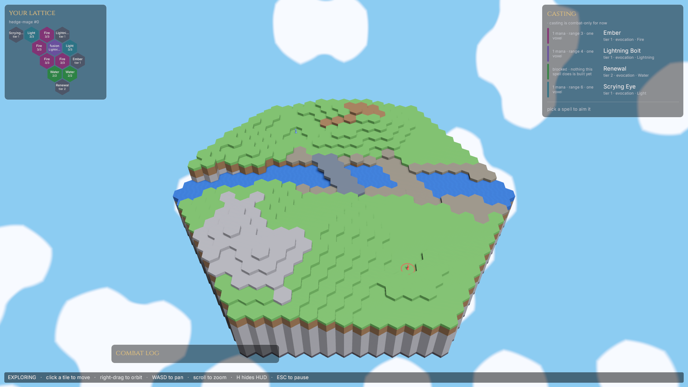
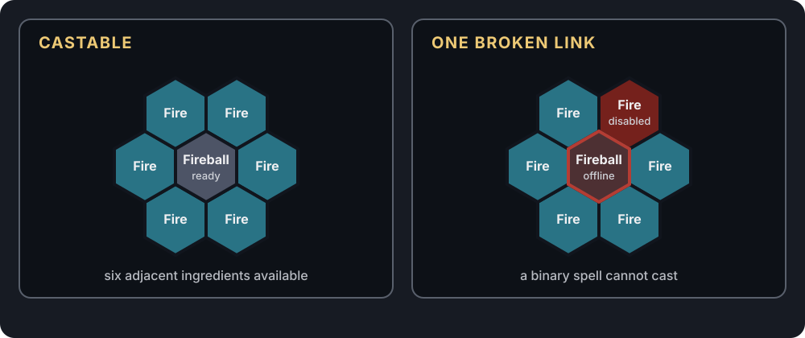
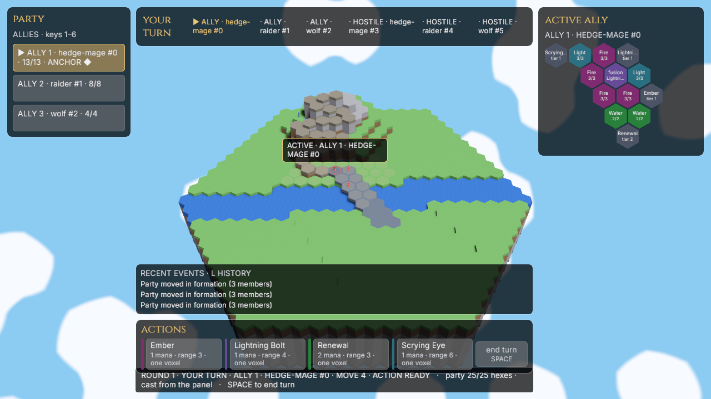
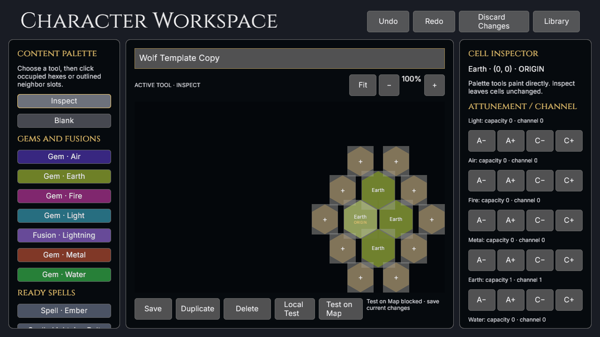
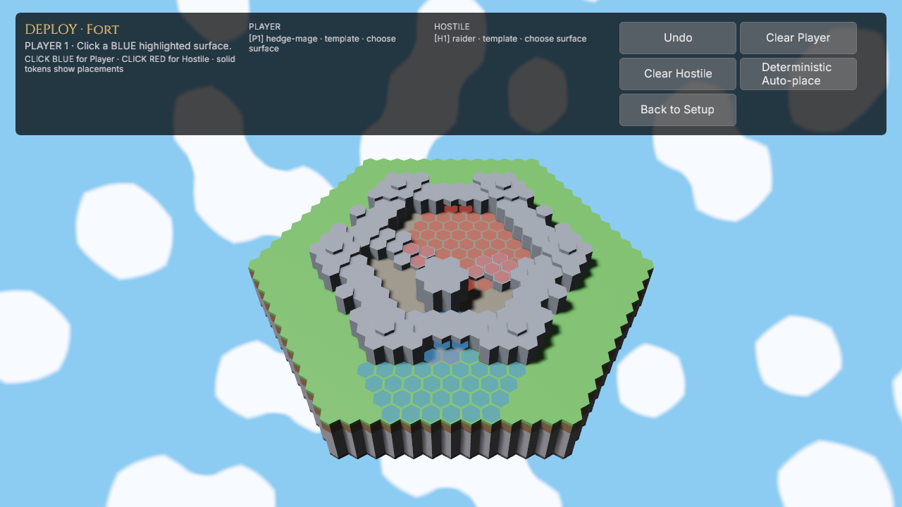

# Hex

> **A deterministic tactical RPG where every character, spell, and wound is a
> pattern of hexagons.**

*The original 2022 logo, kept as a fond artifact of where the project started.*

**Hex** is the working title for a party-based magic game built around one shape.
A party of up to six characters explores an isometric world in real time, then
shifts into deliberate turns when a fight or timed action begins. Travel and combat
happen on the same map: a three-dimensional landscape of hexagonal prisms where
elevation, routes, sight, and terrain all matter.

The repetition is the point. The world is made of hexes, but so are characters,
elements, and spells. Instead of collecting independent abilities and watching a
health bar fall, players arrange a connected magical structure and then fight to
keep its important relationships intact.

<!--
Regenerate readme_assets/procedural-hills.png with:
HEX_REVIEW_SCENARIO="Procedural Hills" \
HEX_REVIEW_CAPTURE="readme_assets/procedural-hills.png" \
cargo run --release -p hex_game --features map-review
-->

*The current Procedural Hills build. The same terrain supports exploration,
positioning, and combat.*

## Magic is geometry

Every character and enemy is defined by a **lattice**: a finite grid of hexagonal
cells containing elemental gems, spells, and fusions. Gems hold mana. A spell can
draw power only from the cells directly beside it, and a fusion combines adjacent
basic elements into a more complex ingredient.

That turns character building into a packing problem. An Ember spell needs one
neighboring fire gem; Fireball needs a complete ring of six. Sharing gems lets a
small lattice hold more spells, but those spells compete for the same mana and fail
together when a shared cell breaks. Spreading out costs more space but creates
redundancy. There is no universally best layout: efficiency and resilience are the
same geometric choice viewed from opposite sides.

*Binary spells work only while every required neighbor is available.*

## Damage changes the character

There is no hit-point bar. Damage **disables lattice cells**.

Losing an expendable gem may be survivable. Losing a shared gem can silence several
spells. Breaking a fusion can disconnect everything downstream, while disabling a
gem that funds an enchantment also breaks the enchantment. The defender normally
chooses which cells to surrender, so taking damage is a sequence of tactical
decisions about what the character can still afford to be.

This also makes a character's build their body. Tight, powerful lattices are brittle;
roomy lattices endure. The design intends variable-power rituals to remain useful
after binary spells have lost a required link, giving a battered character meaningful
options instead of merely smaller numbers.

## Knowledge replaces dice

Combat resolution is deterministic: no to-hit rolls and no damage variance.
Uncertainty comes from incomplete information instead. Enemy lattices and intentions
begin hidden, while sight and Light-based divination reveal what is worth attacking
or defending.

The design does not protect a player from the consequences of positioning. Future
area effects may touch allies, enemies, and their caster. Planned terrain magic lets a
spell describe the energy and volume it applies while the world decides how dirt,
stone, water, or another material responds. Winning should come from understanding
the board, not rerolling it.

## The current playable slice

The current pre-alpha build makes the lattice idea playable end to end. It is still
an early skeleton, not the complete game described above: deterministic
procedural terrain, stacked-surface movement and path preview lead into combat on the
same map, where live lattices power spells and absorb wounds.

The combat HUD shows the stable initiative order, acting unit, selected ally, aimed or
retained hostile, and decision owner without conflating those roles. It keeps the
relevant lattices visible and records a bounded, knowledge-safe event log. A hostile
starts as only a known presence—its formation and capacity stay hidden. Scrying Eye
reveals the complete live lattice for a bounded number of rounds, including current
mana and disabled cells, without exposing earlier hidden choices retroactively.

Ember deals direct damage and applies Burn for two of the target's actual turns.
Incoming damage is command-modal: movement, casting, and ending the turn wait while
the player chooses and confirms which live cells to disable. A unit with no live cells
is downed and retained for restoration rather than erased. Complete-party controls
provide a stable ally rail, Group/Solo exploration, formation editing and bottleneck
compression, recovery, deterministic AI, retained outcomes, and the integrated 3v3
Party Trial.

<!--
Regenerate readme_assets/party-trial-combat.png with:
HEX_WALK_SCRIPT=walks/readme_party_trial.ron \
HEX_WALK_OUT=.context/readme-captures/party-trial \
HEX_WALK_SIZE=1280x720 \
HEX_GAME_DATA_DIR=.context/readme-captures/party-trial-data \
cargo run --release -p hex_game --features visual-walk
cp .context/readme-captures/party-trial/party-trial-combat.png \
  readme_assets/party-trial-combat.png
-->

*New Game's Party Trial entering combat. Exploration, formation traversal, and the
turn-based fight share one battlefield.*

The surrounding application is still deliberately pre-alpha, but it now has a real
shell: New Game, one disposable exploration resume, persistent display and volume
preferences, fixed centralized input actions, normalized unsigned release artifacts,
separate character and spell creation, and a Combat Lab for deterministic deployment
and fixture testing. Terrain-changing spells, unit obstruction, rout and surrender,
durable saves, audio content, input rebinding, signing, storefront integration, and
much of the larger design remain ahead. The exact boundary is recorded in the
[project status](docs/planning/status.md).

### Play the current build

The title screen keeps the primary application routes together: **Continue**, **New
Game**, **Creators**, **Combat Lab**, **Scenarios**, **Settings**, and **Quit**. **New
Game** launches Party Trial as the hidden integrated default. **Scenarios** opens the
separate development catalog, grouped into scrollable **Maps** and focused **Demos**;
**Creators** opens character and spell authoring, while **Combat Lab** provides a
transient roster/deployment Sandbox across all sixteen shipped maps and a searchable
fixed-fixture selector for Ability Lab, Raider Mirror, and creator-format matrices.
**Continue** restores one explicitly saved exploration slot through the ordinary
loading flow. Saving is available only while paused in a safe exploration state;
combat, movement, and open decisions refuse it. The slot is bound to its build,
scenario content, generator contract, roster, and terrain, so incompatible or corrupt
data is reported instead of partially loaded. New Game never overwrites it.

<!--
Regenerate the Creator and deployment screenshots with:
HEX_WALK_SCRIPT=walks/readme_creator_lab.ron \
HEX_WALK_OUT=.context/readme-captures/creator-lab \
HEX_WALK_SIZE=1280x720 \
HEX_GAME_DATA_DIR=.context/readme-captures/creator-lab-data \
cargo run --release -p hex_game --features visual-walk
cp .context/readme-captures/creator-lab/character-creator.png \
  readme_assets/character-creator.png
cp .context/readme-captures/creator-lab/combat-lab-deployment.png \
  readme_assets/combat-lab-deployment.png
-->

*Characters are built as the same true-colour lattice used by combat, then saved
before they can enter a map.*

**Settings** persists fullscreen/window size, presentation mode, and master,
music, effects, and UI volume values. The volume buses and fixed action map are seams
for later audio and rebinding work; Wave 5 does not pretend those products exist yet.

| Input | Action |
|---|---|
| Right-mouse drag | Orbit the camera around its focus |
| `W` `A` `S` `D` | Pan the camera |
| Mouse wheel | Zoom |
| Hover / left-click a hex tile | Preview a route / move along it |
| Click a spell row, then a lit target | Aim a cast |
| `TAB` / `ENTER` / `Q` | Cycle aimed units / confirm the cast / cancel aiming |
| `SPACE` | End the current player turn; hostile turns cannot be skipped |
| `1`–`6` | Select a party member while exploring |
| Party rail controls | Switch Group/Solo movement, select a formation, and edit assignments |
| `R` | Recover the whole party while exploring |
| `F5` while paused in exploration | Atomically replace the one resume slot |
| `H` | Hide or show ordinary readouts; an active damage choice stays visible |
| Click lattice cells, then `ENTER` | Choose and confirm which cells incoming damage disables |
| `ESC` | Pause, or leave the title screen |
| `BACKSPACE` | Return to the owning Creator, Combat Lab setup, or title screen |

The Creator's local mechanics test remains the focused place to cast, channel,
disable, restore, and break enchantments without constructing a map combat. See the
[Creator and Combat Lab contract](docs/systems/creator-and-combat-lab.md) for saved
content, readiness, fixtures, deployment, and frozen Retry behavior.

*Combat Lab loads the real terrain before combat and records exact elevated surfaces
for every deployed unit.*

## Read more

- [The full game design](docs/design/game.md) owns the intended rules and the
  questions that are deliberately still open.
- [Current status](docs/planning/status.md) separates what is built from what is
  provisional or planned.
- [Visual language](docs/design/visual-language.md) describes the art vocabulary
  growing around the hex-prism world.

## Build or contribute

Hex is written in Rust with [Bevy](https://bevy.org/) 0.19. Packaged pre-alpha builds
use the **Hex Game** application identity while Hex remains the working title. Start with the
[setup guide](docs/development/setup.md), read [CONTRIBUTING.md](CONTRIBUTING.md)
before changing code, or use the [documentation index](docs/README.md) to find the
design, system, and development reference for a specific area.

Artists and content authors can also run `cargo editor` for the standalone
[Asset Workshop](docs/systems/asset-workshop.md), which edits the canonical palette,
voxel styles, and object blueprints and exports deterministic review packs.
