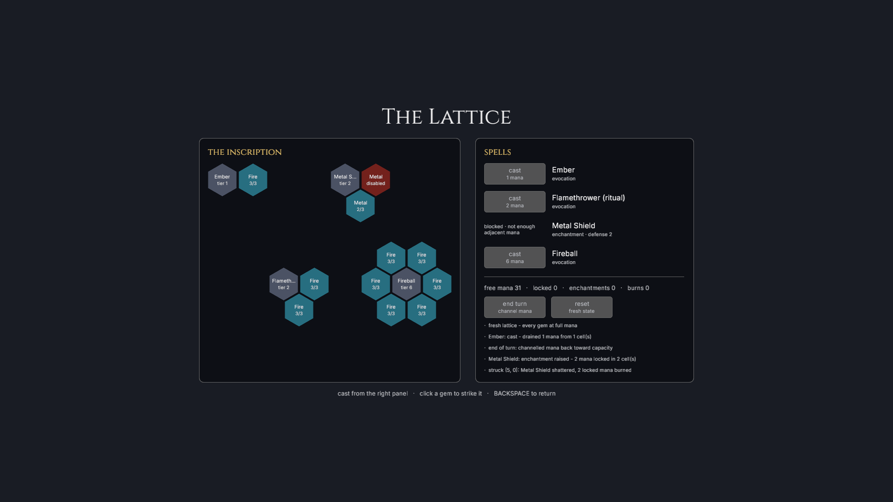

# Hex

> **A deterministic tactical RPG where every character, spell, and wound is a
> pattern of hexagons.**

*The original 2022 logo, kept as a fond artifact of where the project started.*

**Hex** is the working title for a party-based magic game built around one shape.
A party of up to six characters explores an isometric world in real time, then
shifts into deliberate turns when a fight or timed action begins. Travel and combat
happen on the same map: a three-dimensional landscape of hexagonal prisms where
elevation, routes, sight, and terrain all matter.

The repetition is the point. The world is made of hexes, but so are characters,
elements, and spells. Instead of collecting independent abilities and watching a
health bar fall, players arrange a connected magical structure and then fight to
keep its important relationships intact.

<!--
Regenerate readme_assets/procedural-hills.png with:
HEX_WALK_SCRIPT=walks/gameplay.ron \
HEX_WALK_OUT=.context/readme-captures/gameplay \
cargo run --release -p hex_game --features visual-walk
cp .context/readme-captures/gameplay/11-hills.png \
  readme_assets/procedural-hills.png
-->

*The current Procedural Hills build. The same terrain supports exploration,
positioning, and combat.*

## Magic is geometry

Every character and enemy is defined by a **lattice**: a finite grid of hexagonal
cells containing elemental gems, spells, and fusions. Gems hold mana. A spell can
draw power only from the cells directly beside it, and a fusion combines adjacent
basic elements into a more complex ingredient.

That turns character building into a packing problem. An Ember spell needs one
neighboring fire gem; Fireball needs a complete ring of six. Sharing gems lets a
small lattice hold more spells, but those spells compete for the same mana and fail
together when a shared cell breaks. Spreading out costs more space but creates
redundancy. There is no universally best layout: efficiency and resilience are the
same geometric choice viewed from opposite sides.

*Binary spells work only while every required neighbor is available.*

## Damage changes the character

There is no hit-point bar. Damage **disables lattice cells**.

Losing an expendable gem may be survivable. Losing a shared gem can silence several
spells. Breaking a fusion can disconnect everything downstream, while disabling a
gem that funds an enchantment also breaks the enchantment. The defender normally
chooses which cells to surrender, so taking damage is a sequence of tactical
decisions about what the character can still afford to be.

This also makes a character's build their body. Tight, powerful lattices are brittle;
roomy lattices endure. Variable-power rituals remain useful after binary spells have
lost a required link, giving a battered character meaningful options instead of
merely smaller numbers.

## Knowledge replaces dice

Combat resolution is deterministic: no to-hit rolls and no damage variance.
Uncertainty comes from incomplete information instead. Enemy lattices and intentions
begin hidden, while sight and Light-based divination reveal what is worth attacking
or defending.

The game does not protect a player from the consequences of positioning. Area
effects can touch allies, enemies, and their caster. Magic can also persistently
reshape terrain: a spell describes the energy and volume it applies, while the world
decides how dirt, stone, water, or another material responds. Winning should come
from understanding the board, not rerolling it.

## The 0.3 playable slice

Version 0.3 is the first build in which the lattice idea is playable end to end. It is
still an early skeleton, not the complete game described above: deterministic
procedural terrain, stacked-surface movement and path preview lead into combat on the
same map, where live lattices power spells and absorb wounds.

The combat HUD shows both the stable initiative order and the acting unit, keeps the
player's lattice in view, retains a valid hostile target, and records a bounded
knowledge-safe event log. A hostile starts as only a known presence—its formation and
capacity stay hidden. Scrying Eye reveals the complete live lattice for a bounded
number of rounds, including current mana and disabled cells, without exposing earlier
hidden choices retroactively.

Ember deals direct damage and applies Burn for two of the target's actual turns.
Incoming damage is command-modal: movement, casting, and ending the turn wait while
the player chooses and confirms which live cells to disable. A unit with no live cells
is downed and retained for future restoration rather than erased. Terrain-changing
spells, obstruction, rout and surrender, party control, saves, and much of the larger
design remain ahead. The exact, regularly updated boundary is recorded in the
[project status](docs/planning/status.md).

### Play the current build

The title screen groups playable setups into Maps, Combat, and Demos. Ten map
showcases exercise authored and procedural terrain, **Close Quarters** begins inside
the complete 0.3 combat slice, and **Lattice Demo** is the focused rules sandbox.

| Input | Action |
|---|---|
| Right-mouse drag | Orbit the camera around its focus |
| `W` `A` `S` `D` | Pan the camera |
| Mouse wheel | Zoom |
| Hover / left-click a hex tile | Preview a route / move along it |
| Click a spell row, then a lit target | Aim a cast |
| `TAB` / `ENTER` / `Q` | Cycle aimed units / confirm the cast / cancel aiming |
| `SPACE` | End the current player turn; hostile turns cannot be skipped |
| `H` | Hide or show ordinary readouts; an active damage choice stays visible |
| Click lattice cells, then `ENTER` | Choose and confirm which cells incoming damage disables |
| `ESC` | Pause, or leave the title screen |
| `BACKSPACE` | Return to the title screen |

<!--
Regenerate readme_assets/lattice-demo-disabled-gem.png with:
HEX_WALK_SCRIPT=walks/menus.ron \
HEX_WALK_OUT=.context/readme-captures/lattice \
cargo run --release -p hex_game --features visual-walk
cp .context/readme-captures/lattice/06-demo-shield-broken.png \
  readme_assets/lattice-demo-disabled-gem.png
-->

*The interactive rules demo: disabling one funding gem has broken Metal Shield.*

## Read more

- [The full game design](docs/design/game.md) owns the intended rules and the
  questions that are deliberately still open.
- [Current status](docs/planning/status.md) separates what is built from what is
  provisional or planned.
- [Visual language](docs/design/visual-language.md) describes the art vocabulary
  growing around the hex-prism world.

## Build or contribute

Hex is written in Rust with [Bevy](https://bevy.org/) 0.19. Start with the
[setup guide](docs/development/setup.md), read [CONTRIBUTING.md](CONTRIBUTING.md)
before changing code, or use the [documentation index](docs/README.md) to find the
design, system, and development reference for a specific area.

Artists and content authors can also run `cargo editor` for the standalone
[Asset Workshop](docs/systems/asset-workshop.md), which edits the canonical palette,
voxel styles, and object blueprints and exports deterministic review packs.
